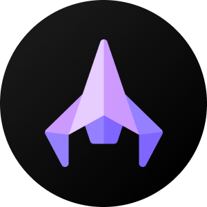
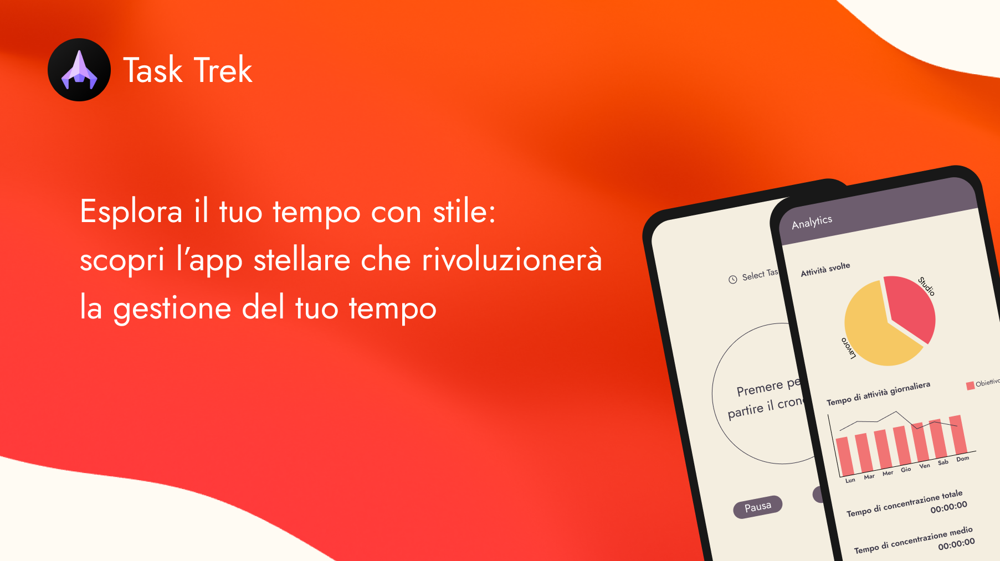

<h1 align="center" style="font-size:28px; line-height:1"><b>Task Trek</b></h1>

    

    

### Che cos'è l'applicazione?
Si tratta di un'applicazione volta alla gestione del tempo in modo ottimale
grazie a degli strumenti pensati appositamente, prendendo anche spunto, non lo
nascondo, da altre applicazioni simili.  
L'idea che ha mosso principalmente l'idea per la nascita del progetto è stata quella
di creare un'applicazione di questo genere, di cui ne esistono già molte, ma rendere
accessibili quelle funzioni che sulle altre applicazioni, di solito, per essere
utilizzate devono essere pagate. 
### UML delle Classi
### UML dei Casi D'uso
### Features
1. Tenere traccia del tempo di concentrazione e della gestione delle pause.
2. Gestire al meglio i propri impegni con la sezione dedicata del calendario.
3. Fare una lista delle attività giornaliere che ci si propone di portare a compimento nella
sezione apposita dell'app per poter creare la propria personale to-do list.
4. Avere una visione grafica dei propri progressi e della propria costanza grazie alla sezione
delle analytics con i grafici che mostrano il proprio andamento e la propria costanza.
### Dependencies
1. [Table Calendar](https://pub.dev/packages/table_calendar): E' stato utilizzato per
creare la grafica e le animazioni del calendario nella pagina dedicata all'interno dell'applicazione.
2. [Supabase Flutter](https://pub.dev/packages/supabase_flutter): E' stato
utilizzato per connettere la nostra applicazione a un database basato
su PostgreSQL presente sulla piattaforma Open Source di Cloud Hosting 
di [SupaBase](https://supabase.com/).
3. [Syncfusion Flutter Charts](https://pub.dev/packages/syncfusion_flutter_charts): E' stato utilizzato per la 
creazione dei vari grafici nella sezione analytics dell'applicazione, creata appositamente per documentare graficamente 
i propri progressi e il raggiungimento dei propri obiettivi.

### Funzionamento Script
Ogni pagina ha al suo interno un Stack utilizzato per la creazione di una Bottom NavBar personalizzata,
la quale a sua volta è stata scritta dentro un file apposito dove si trovano tutti i Widget standard utilizzati
in più pagine come anche l'app bar.    
Il codice per la gestione dell'interfaccia è stato gestito nel modo più ordinato il possibile, creando i widget 
esternamente e richiamandoli dentro l'interfaccia stessa in modo da non sovraccaricare eccessivamente il codice 
principale: per eventuali manutenzioni o miglioramenti è la soluzione ottimale.    
L'applicazione comunica inoltre con un DataBase in cloud Hosting grazie al servizio Open Source SupaBase. E' stata
creata, per questa comunicazione, una classe apposita che di chiama DBApp e che al suo interno ha un metodo per 
inizializzare l'istanza che permette di comunicare con il DataBase e tutte le funzioni per scaricare, caricare, 
eliminare e modificare eventuali record sulle tabelle. Sono state create anche delle classi per generare delle
eccezioni appostie in caso di mal funzionamento, utili soprattutto in fase di scrittura del codice.