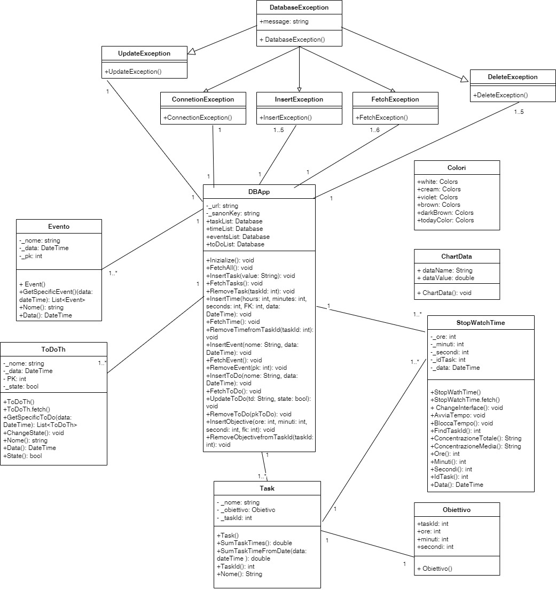
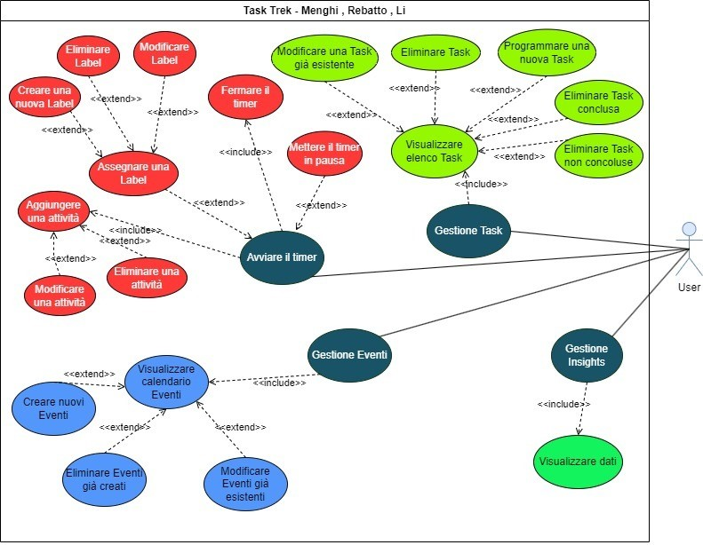

<h1 align="center" style="font-size:28px; line-height:1"><b>Task Trek</b></h1>

    

    

## Che cos'è Task Trek?
Si tratta di un'applicazione volta alla gestione del tempo in modo ottimale
grazie a degli strumenti pensati appositamente, prendendo anche spunto, non lo
nascondo, da altre applicazioni simili.  
L'idea che ha mosso principalmente l'idea per la nascita del progetto è stata quella
di creare un'applicazione di questo genere, di cui ne esistono già molte, ma rendere
accessibili quelle funzioni che sulle altre applicazioni, di solito, per essere
utilizzate devono essere pagate. 
## UML delle Classi

In questo diagramma possiamo osservare le varie classi utilizzate per questo progetto:
è evidente come quella principale che comunica con tutte le altre sia DBApp, ovvero la classe
che ci permette di comunicare con il DataBase in remoto e di effettuare tutte le operazioni 
CRUD sulle varie tabelle.  
Di fatto vi sono al suo interno diversi metodo che ci permettono in primis, scaricando i dati dalle
varie tabelle, di avere una lista di istanze delle classi a cui è collegato per permetterci di non accedere
al DataBase ogni volta che si necessita di un semplice dato: di fatto è un'attività che richiede molto tempo
e rallenterebbe notevolmente l'uso dell'applicazione. 
quando viene avviata l'applicazione viene richiamato il metodo FetcAll() della classe DBApp che scarica 
immediatamente tutti i dati in locale.   
Altra classe molto importante è quella delle task, ovvero un'attività di cui vogliamo misurare le tempistiche
che abbiamo per svolgerle ed è quindi collegata a una classe StopWatchTime cui istanze non sono altro che i tempi
registrati e Obiettivo che è il tempo a cui ci prefissiamo di arrivare giornalmente per una singola task.   
Ci sono poi le classi ToDoTh ed Evento. La prima non serve ad altro se non registrare delle faccende da svolgere da 
inserire una lista come le classiche ToDoList che potete trovare in giro. Evento invece è la classe che si occupa di
registrare i vari eventi che saranno poi visualizzabili nella sezione calendario dell'applicazione.  
Abbiamo infine le classi per generare le eccezioni in caso di errore per qualche operazione all'interno della classe del
DataBase(Chiaramente le eccezioni sono personalizzate e indirizzate a ogni possibile errore che possa verificarsi nell'interazione)
e due classi considerabili come indipendenti che sono la classe Colori, ovvero una semplice classe per la gestione dei colori dell'applicazione: questo consente di avere uno standard e
anche un punto accessibile per cambiare in qualsiasi momento i colori della palette in modo veloce, cosa molto utile nella definizione
di, ad esempio, dei temi, e la classe ChartData, ovvero una classe le qui istanze vengono utilizzate come dati per i grafici nella sezione
Analytics dell'applicazione.

## UML dei Casi D'uso
 
All’interno del diagramma dei casi d’uso possiamo trovare quattro casi d’uso principali: Gestione Task, Avviare il timer, Gestione Eventi, Gestione Insights. 
Ognuno di questi a sua volta include o estende altri casi d'uso. Ad esempio “Gestione Task” è un caso incluso tramite l'include ciò significa che fa parte del 
comportamento di quello che lo include. In questo caso “Gestione Task” è incluso nel caso “Visualizzare elenco Task” ciò significa che la gestione 
delle task è totalmente dipendente dal caso d’uso precedentemente elencato. “Visualizzare elenco Task” a sua volta viene esteso tramite l'extend.   
Prendiamo per esempio in considerazione il caso d’uso “Eliminare Task”, Quest’ultimo è una vera e propria estensione del caso “Visualizzare elenco 
Task” quindi può comportarsi in maniere indipendente. Ciò vale per ogni caso d’uso sopra citato ovvero: Avviare il Timer, Gestione Eventi, Gestione 
Insights. Ogni caso d’uso appunto può possedere delle estensioni o delle inclusioni che ne limitano il libero comportamento, ad esempio “Avviare il 
Timer” include il caso “Aggiungere una attività” perché i due casi sono strettamente collegati e dipendenti l’uno dall’altro, al contrario di ciò il 
caso “Assegnare una Label” è un caso di estensione quindi collegato tramite un extend che porterà i due casi a essere collegati ma il caso “client” 
quindi quello principale che in questo caso è “Avviare il timer” si modera in maniera indipendente dal caso “Assegnare una Label”. Anche il caso “Gestione 
Eventi” viene collegato con un include al caso “Visualizzare calendario Eventi” che a sua volte possiede delle estensioni come il caso “Creare nuovi 
Eventi”, “Eliminare Eventi già creati”, “Modificare Eventi già esistenti”. Infine il caso d’uso “Gestione Insights” include il caso “Visualizzare dati”. 
Per concludere tutti e i quattro casi d’uso principali sono collegati tramite una assegnazione a un attore che in questo caso è chiamato “User”.
## Features
1. ⌚Tenere traccia del tempo di concentrazione e della gestione delle pause.
2. 📅Gestire al meglio i propri impegni con la sezione dedicata del calendario.
3. ✅Fare una lista delle attività giornaliere che ci si propone di portare a compimento nella
sezione apposita dell'app per poter creare la propria personale to-do list.
4. 📈Avere una visione grafica dei propri progressi e della propria costanza grazie alla sezione
delle analytics con i grafici che mostrano il proprio andamento e la propria costanza.
### Dependencies
1. [Table Calendar](https://pub.dev/packages/table_calendar): È stato utilizzato per
creare la grafica e le animazioni del calendario nella pagina dedicata all'interno dell'applicazione.
2. [Supabase Flutter](https://pub.dev/packages/supabase_flutter): È stato
utilizzato per connettere la nostra applicazione a un database basato
su PostgreSQL presente sulla piattaforma Open Source di Cloud Hosting 
di [SupaBase](https://supabase.com/).
3. [FL Charts](https://pub.dev/packages/fl_chart): È stato utilizzato per la 
creazione dei vari grafici nella sezione analytics dell'applicazione, creata appositamente per documentare graficamente 
i propri progressi e il raggiungimento dei propri obiettivi.

## Funzionamento dello Script
Ogni pagina ha al suo interno un Stack utilizzato per la creazione di una Bottom NavBar personalizzata,
la quale a sua volta è stata scritta dentro un file apposito dove si trovano tutti i Widget standard utilizzati
in più pagine come anche l'app bar.    
Il codice per la gestione dell'interfaccia è stato gestito nel modo più ordinato il possibile, creando i widget 
esternamente e richiamandoli dentro l'interfaccia stessa in modo da non sovraccaricare eccessivamente il codice 
principale: per eventuali manutenzioni o miglioramenti è la soluzione ottimale.    
L'applicazione comunica inoltre con un DataBase in cloud Hosting grazie al servizio Open Source SupaBase. È stata
creata, per questa comunicazione, una classe apposita che di chiama DBApp e che al suo interno ha un metodo per 
inizializzare l'istanza che permette di comunicare con il DataBase e tutte le funzioni per scaricare, caricare, 
eliminare e modificare eventuali record sulle tabelle. Sono state create anche delle classi per generare delle
eccezioni apposite in caso di mal funzionamento, utili soprattutto in fase di scrittura del codice. 
Osserviamo ora il comportamento delle altre classi con cui DBApp comunica:
### Classe Evento
**Metodo getSpecificEvent(DateTime data)**:
Come parametro richiede una data espressa col tipo DateTime e la sua funzione è quella di ottenere gli eventi, ritornando
quindi un'altra lista, della list all'interno di DBApp che hanno la data specificata come parametro al metodo.
### Classe Obiettivo
Questa classe viene utilizzata principalmente per memorizzare i dati inerenti a un obiettivo correlato a una data
task, inclusi l'ID della task a cui fa riferimento e le ore, i minuti e i secondi che l'utente ha scelto di fissare.
### Classe StopWatchTime
**Metodo avviaTempo(int taskId)**:
Richiede come parametro l'ID di una task e ha lo scopo di far partire un cronometro che registrerà il tempo per cui
viene svolta l'attività.    
**Metodo bloccaTempo()**:
Non richiede nessun parametro e ha semplicemente lo scopo di bloccare lo scorrimento del cronometro e richiamare il metodo
nella classe DBApp per inserire il valore nek DataBase.   
**Metodo findTaskId(String searchString)**: 
Come parametro richiede la stringa che corrisponde al nome della Task da trovare. Una volta scansionata la lista di Task, che
si trova sempre nella classe DBApp, restituisce l'Id che corrisponde alla task cui nome era il parametro del metodo.
**Metodo ConcentrazioneTotale() e Metodo ConcentrazioneMedia()**:
Si occupano rispettivamente di sommare tutti i tempi nella lista apposita e di ritornare quella somma e di fare la media matematica
(quindi prima sommando e poi dividendo per il numero di tempi totali) dei tempi dentro la lista e ritornandone il valore.
### Classe Task
**Metodo SumTaskTimes()**:
Calcola la somma totale dei tempi, filtrandoli nella lista dei tempi, dell'istanza corrente di task.
**Metodo SumTasksTimeFromDate(DateTime time)**:
Come parametro richiede una data e si occupa di sommare tutti i tempi registrati in quella data, convertendo il tutto in ore
e ritornandone il valore
